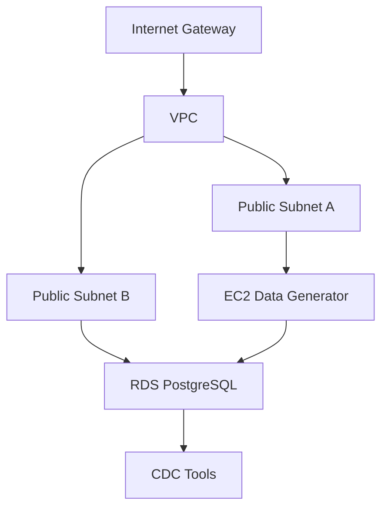

# PostgreSQL CDC Demo Infrastructure

This repository contains Terraform configurations to set up a demonstration environment for PostgreSQL Change Data Capture (CDC). The infrastructure includes a PostgreSQL RDS instance with logical replication enabled and an EC2 instance for data generation. COMING SOON - A ClickHouse instance creation with ClickPipes for PostgreSQL CDC.

## Getting Started

1. Clone the repository:
   ```bash
   git clone git@github.com:ClickHouse/postgresql_cdc_demo.git
   cd postgresql_cdc_demo
   ```

## Architecture Overview



## Components

1. **VPC and Networking**

   - VPC with CIDR block 10.0.0.0/16
   - Two public subnets in different availability zones
   - Internet Gateway for public access
   - Route tables for public subnets

2. **RDS PostgreSQL**

   - PostgreSQL 17.2 instance
   - Logical replication enabled
   - Publicly accessible (for demo purposes)
   - Custom parameter group for CDC configuration

3. **EC2 Data Generator**

   - Amazon Linux 2 instance
   - Configured to generate test data
   - User data script for setup and data generation

4. **Security Groups**
   - EC2 Security Group: Allows SSH access
   - RDS Security Group: Allows PostgreSQL access from EC2 and external CDC tools

## Prerequisites

- AWS CLI configured with appropriate credentials
- Terraform >= 1.0
- AWS profile with sufficient permissions

## Configuration

1. Copy the example variables file:

   ```bash
   cp terraform.tfvars.example terraform.tfvars
   ```

2. Modify `terraform.tfvars` with your desired configuration:
   - AWS region and profile
   - Database credentials
   - Instance types and sizes
   - Network configurations

## Usage

### With terraform.tfvars (Recommended)

1. Initialize Terraform:

   ```bash
   terraform init
   ```

2. Review the planned changes:

   ```bash
   terraform plan
   ```

   This will use the variables defined in terraform.tfvars

3. Apply the infrastructure:

   ```bash
   terraform apply
   ```

   When prompted, type 'yes' to confirm the changes

4. To destroy the infrastructure:
   ```bash
   terraform destroy
   ```
   When prompted, type 'yes' to confirm the destruction

### Without terraform.tfvars

If you don't want to use terraform.tfvars, you can provide variables directly through command line:

1. Initialize Terraform:

   ```bash
   terraform init
   ```

2. Review the planned changes with variables:

   ```bash
   terraform plan
   ```

3. Apply the infrastructure with variables:

   ```bash
   terraform apply
   ```

4. To destroy the infrastructure:
   ```bash
   terraform destroy
   ```

## Important Notes

- This is a demonstration environment. For production use:
  - Restrict security group access
  - Use secure credentials
  - Consider using private subnets
  - Implement proper backup strategies
  - Enable encryption at rest

## File Structure

- `main.tf`: Main Terraform configuration file
- `variables.tf`: Input variable definitions
- `outputs.tf`: Output definitions
- `terraform.tfvars.example`: Example variables file

## Contributing

1. Fork the repository
2. Create a feature branch
3. Commit your changes
4. Push to the branch
5. Create a Pull Request

## Roadmap

1. [ ] Add ClickHouse instance creation
2. [ ] ClickPipes for PostgreSQL CDC - Waiting for Terraform provider for ClickPipes to support PostgreSQL CDC
